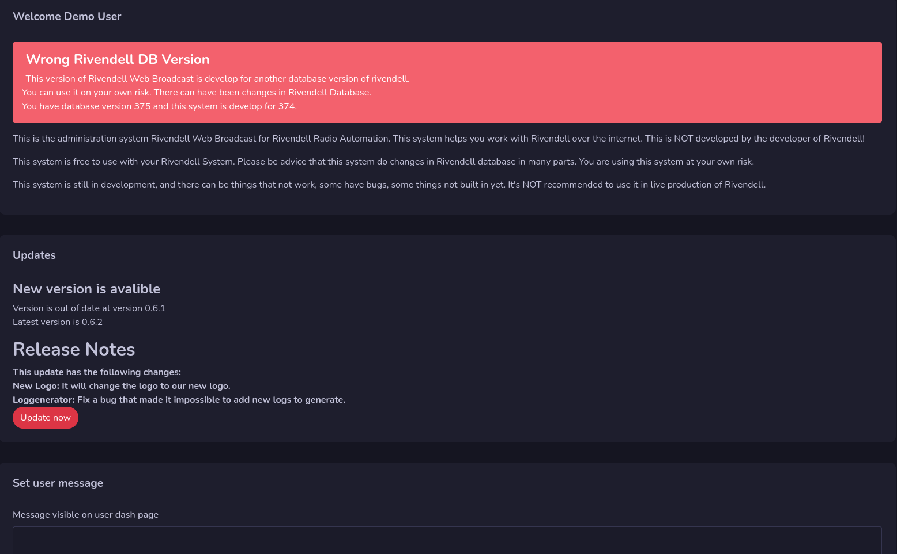

# Admin Dashboard

The Admin Dashboard is for you users that have access to administration in this system.
This is just for information on the web system.

## Rivendell DB Version Warning
This system will warn you if you are using rivendell with wrong database version.

You can use it anyway but there can be changes to rivendells database that not work with this web system. As always you use it on your own risk.

## Updates
If there are new updates on the release page on github you will get notice about it here. There will be an **Update now** button available.

If You press the **Update now** button it will take you to the update part and put your system in maintenance mode. See Update section for more information about to update.

## Set user message
This part is only visible if your account have access to this part. This is where you set the message that will be displayed on users dashboard.