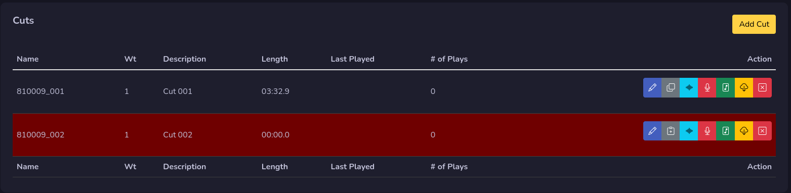

# Audio Cart

Just like in rivendell you can edit the cart information easy. And when you have done your changes just press save to save your changes.

## Cuts

In your audio cart management you will find your cuts, each cut is an audio file.

### Add Cut
You can easy add a new empty cut by pressing the add cut button. You will find your new empty cut at the bottom of the table.

### Edit Cut Info

If you press the pen button on the cut, you will open the cut info window where you can change your cut settings. This is where you can adjust the day parts, cut name etc.

Just press save button to save your changes.

### Edit Audio Markers

The light blue button that looks like audio waves is where you can manage your cuts audio markers. You can set your fades, segue, talk and hook.

You can use the following shortcuts on your keyboard:

| Button        | Description                          |
| ------------- | ------------------------------------ |
| `Space`       | Play/Pause                           |
| `Right Arrow` | Forward one second                   |
| `Left Arrow`  | Backward one second                  |
| `T`           | Add Talk Start and Stop              |
| `S`           | Add Segue Start and Stop             |
| `F`           | Add Fade up                          |
| `G`           | Add Fade down                        |
| `H`           | Add Hook Start and Stop              |

**Don't forget to press Save Markers when you are done!**

### Import Audio

You can import an audio file to your cut by pressing on the green note button.

Just like when you import audio carts, you set your settings first and then you drag your audio file, or click in the blue box to upload your file. **Only one file is allowed**

### Export Audio

You can export your cut audio by pressing the yellow cloud download button, a new window will open up and you will be able to select your audio settings.

When you click on the export audio button a new window will open up and your audio will start downloading. It will be named after your title and artist.

### Remove cut
The red button with an **X** on it will remove the cut, you will get a warning before that you need to confirm. If you remove it, you can not get it back later.