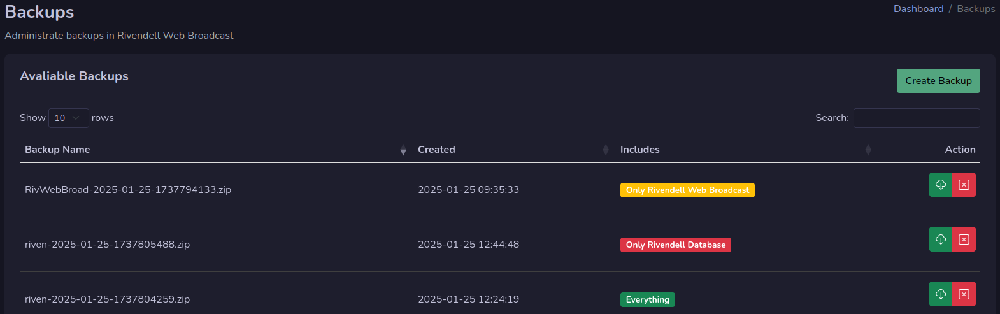
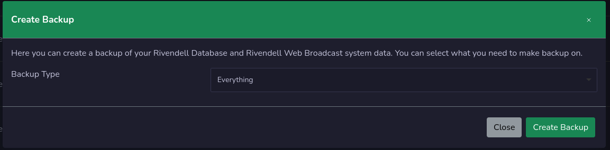

# Backups

Backup page is where you manage your backups. To have access to backup function, an administrator needs to enable this part on your user settings. Then it will be visible in the admin section.

## Backups
On the backup page you will find all your backups that is created. Here you can download your backup by pressing the green download button.

You can also remove your backup by pressing the red remove button.
If you have cron job setup for automatic backup, then you backup files will be removed automatic if older than 7 days or one month depending on what you have setup in the settings.

## Create backup

You can create a new backup by pressing the Create backup button. Select what you want to backup, and press create backup button.

Your backup will now be avaliable for download.