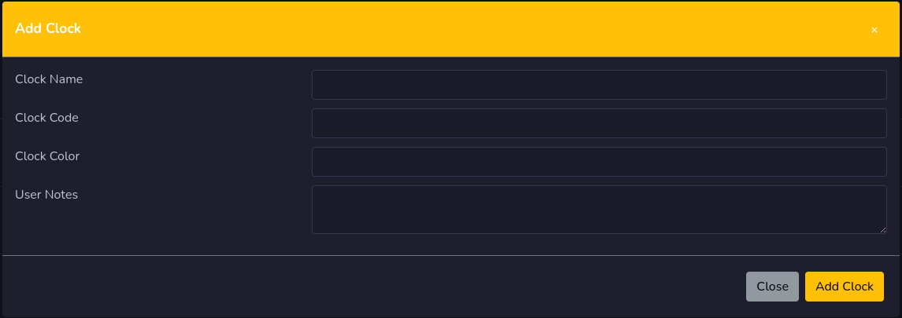
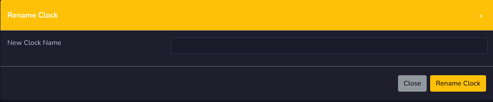

# Clocks

Clocks is where you find your clocks for log management. Each clock is one hour.

<iframe width="560" height="315" src="https://www.youtube.com/embed/71DGQ5_J_o4?si=A4A2JHcRcLj9rIzA" title="YouTube video player" frameborder="0" allow="accelerometer; autoplay; clipboard-write; encrypted-media; gyroscope; picture-in-picture; web-share" referrerpolicy="strict-origin-when-cross-origin" allowfullscreen></iframe>

On each clock line you can edit clock, rename clock and remove clock.

!!! Danger

    When removing a clock that is added to the grid, that grid hour(s) will be cleared.

## Add Clock

To add a clock, press the add clock button. Fill out the form with clock name, clock code, select a color, and if you want you can add user notes.

## Rename Clock

You can give your clock a new name if you press the yellow **T** button on the selected clock, give it a new name and press rename clock button.