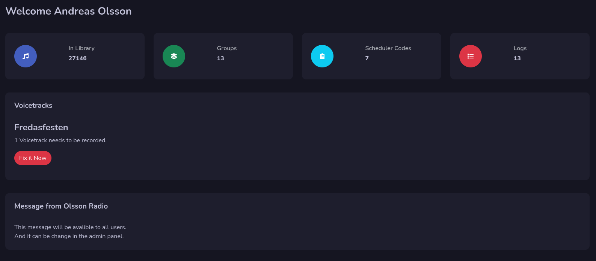

# Dashboard

This is the first thing you will see when you log in. This is just an information page.

## Statics

On top you will get total data of carts in library, how many groups you have, scheduler codes and logs.

## Voice tracks

If there are voice tracks that needs to be recorded on your selected service you will get the information here. Just press the **Fix it now** button to open up that log for voice tracking.

## Message from radio station

If the radio station has written an message to all your users, it will be available here on the dashboard.