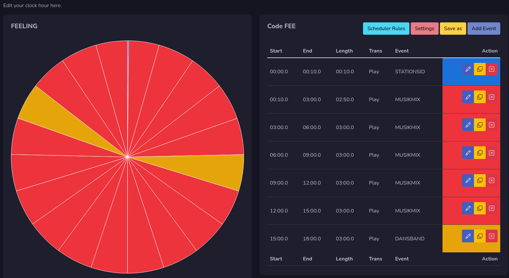
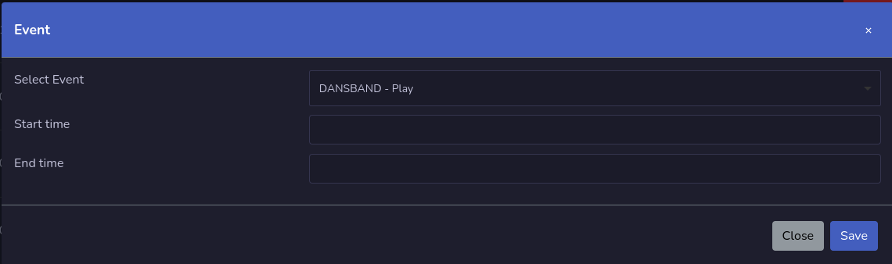
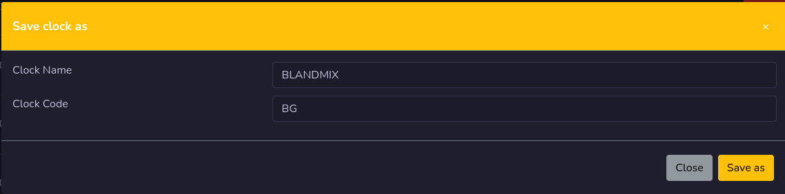

# Edit Clock

This is the place to manage your clock hour for selected clock. Each row is one event, that will be the audio when the log is generated.

You can se start time, end time, length, transition and event on each line.

The background color under action column is the event color.

On each line you can edit, copy and remove that line.

## Add Event

Add a new clock line here by selecting the event you would like to use, then you set a start and end time.

## Save As

The save as allows you to save this clock with a new name, good to use if you need to make a copy of the existent clock.

## Services

Here can you select what services this clock will belong to. You can select multiple services.

## Color

Here you can select color that this clock will have. The color code needs to be in hex format if you type it your self.

## Scheduler Rules

Here you can see what scheduler rules you have set for this clock. To do changes on one scheduler code press the edit button.

### Edit Scheduler Rule

Here can you do your changes for the scheduler rule code. If you select **none** in after fields they will be empty and not used.