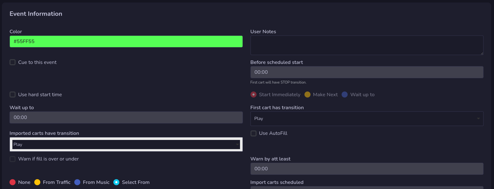
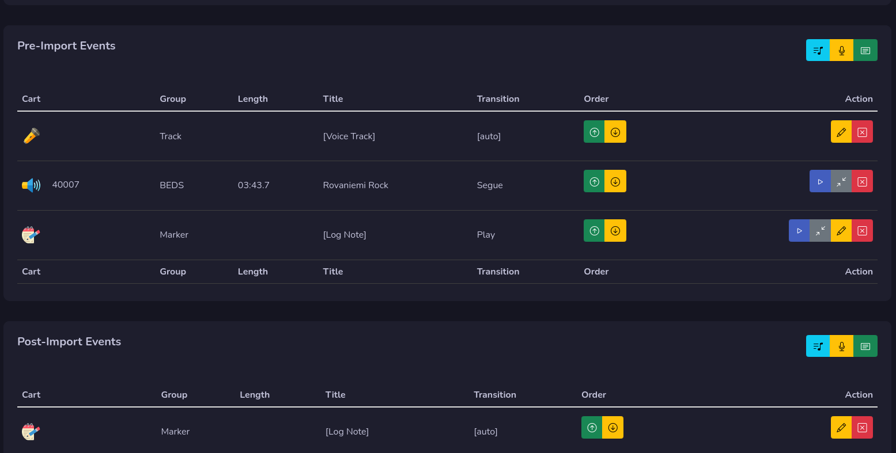

# Edit Event

The edit event has 3 parts and is just like in Rivendell with all options avalible for you.

## Event Information
The Event information holds all information about how this event will work. All settings like hard time, import etc.

Depending what you select options will be enabled or disabled.

!!! Warning

    If you check the Use AutoFill, don't forget to add music in autofill section under services in admin section if you have access to it.

## Pre & Post Import Events

Here you can add your pre and post import stuff to the event.

On top of each you will find three buttons, the library note button (light blue) allow you to select cart from library.

The yellow microphone button allows you to add voice track.

The green note button allows you to add a log note.

When you add one it will be added on the last row.

### Order
You can change order of an event line by press the up and down buttons under order.

### Actions
Under actions you can manage your event line. Depending on what it is you have some options.

The play button allows you to set transition to play, and the one with two arrows allows you to set transition to segue.

The yellow pen button allows you to edit that line.
!!! Warning

    Carts can not be edited.

The red **X** button removes that line.
!!! Warning

    It's not possible to set transition on the first line!
