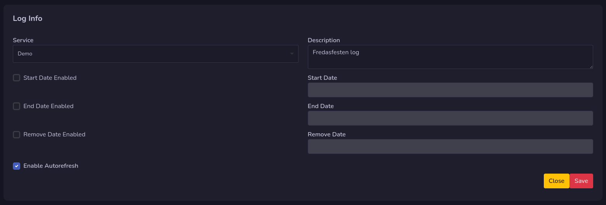
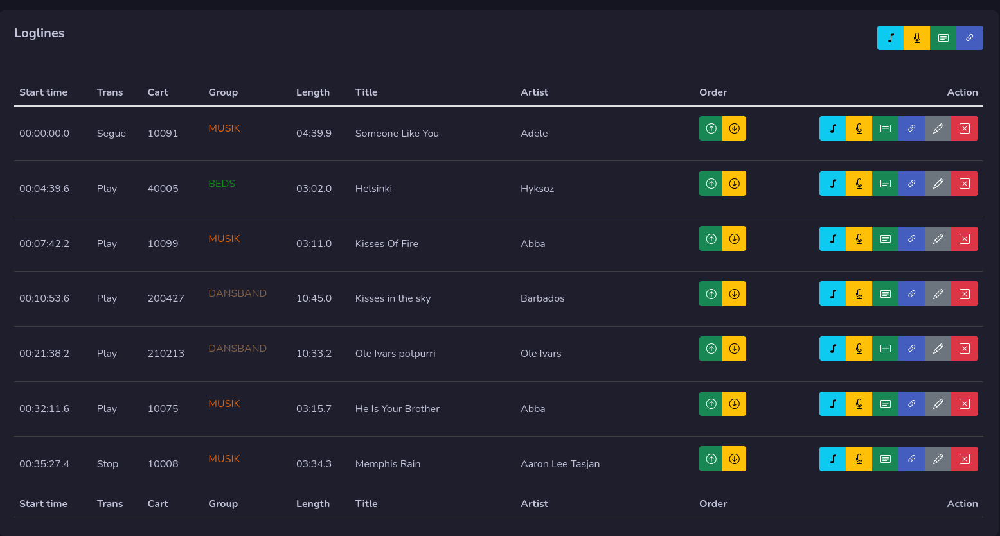
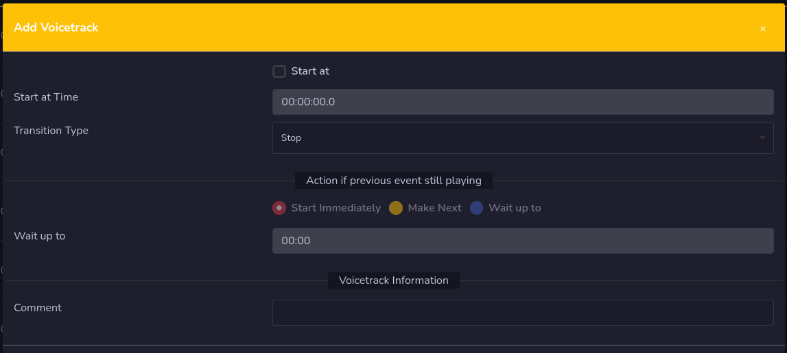

# Edit Log

This is where you edit your log. During the edit, all changed are stored local on the server and will not affect the log on rivendell until you press the save button.

**When you edit your log, an log lock will be added to that log, so no one else can do changes in the log as long as you edit the log.**

**It's important that you press the close button when you are done to release the lock, and if you don't do anything for 30 minutes, a warning will pop up and you have 60 seconds to move your mouse or press a button. If you don't do it, the log will auto close without save your changes.**

## Loglines

Here is where you manage your log lines, on top you find buttons to add a new line at the bottom. You can add **Carts, Voice track, Log Note and Log Chain**

On each line you also find this buttons, if you use them here, a new log line will be added above that line instead.

There are also order buttons on each line, move that line up one step by pressing the up arrow, or move it down one step by pressing down.

### Add Cart

You can add a new cart by pressing the music note button. You set your settings, and press the Select Cart button to select a cart to add. **Both audio and macro carts can be added**

Press save to add it to the log line.

### Add Voice track

By pressing the yellow microphone button you can add a voice track to the log. Do your settings and add a comment to add a new voice track.

### Add Marker

To add a marker (log note) you press the green button that looks like a paper note. Do your settings, and write a comment and a label.

### Add Log Chain

You can add a log chain to your log by pressing the button that looks like a chain. Do your settings and press select log chain button to open up the window to select logs. You can select logs from all your available services.

### Edit Log line
You can edit a log line by pressing the pen button, a window will pop up for you to do your changes.

### Remove Log line
By pressing the red button marked **X** you will remove your log line, you will need to confirm it first.

## Save your log
Don't forget to save your log! Your log will not be active until you save it. Only when you press save, changes will be sent to rivendell to save your log.

When you save your log it will start with line number 0 from top, also the order will start from 0. We need to re calculate the line number on save due to rivendells API can not save logs if they not start at line number 0.