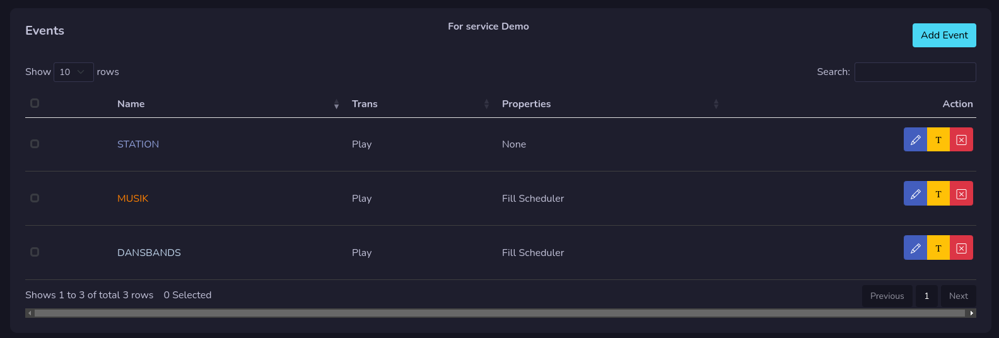
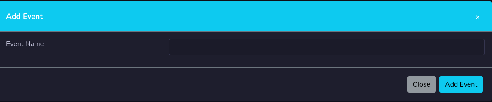

# Events

All your events for log management you will find here, on each event you can choose to edit event (pen button), rename event (yellow **T** button) or remove event (red **X** button)

!!! Warning

    You will only get events that are assigned to the selected service.

## Add event

To add an new event, press the add event button. Give the event a name and press add event button. You will be redirected to start edit the new event.

## Rename Event

You can give your event a new name. Press the yellow T button on selected event and give it a new name.

## Remove Event
To remove a event you press the red button with an **X** on it. You need to confirm the remove.

You can also remove multiple events by select the check boxes and press delete selected button.

!!! Danger

    You can not remove an event if it added to a clock. You need to remove it from the clock first.