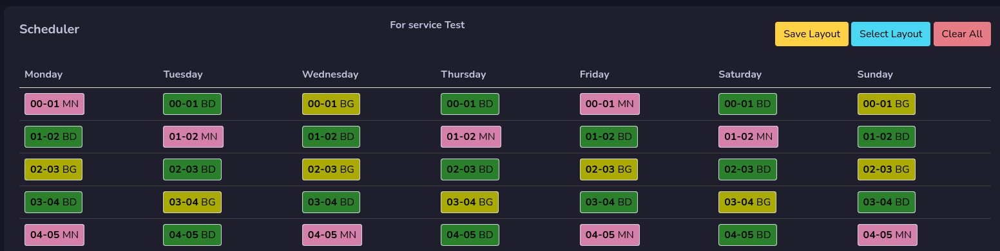
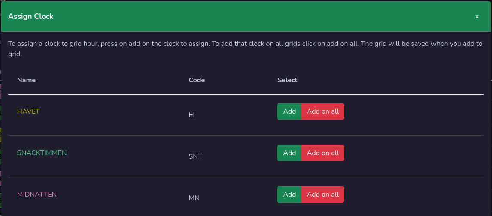
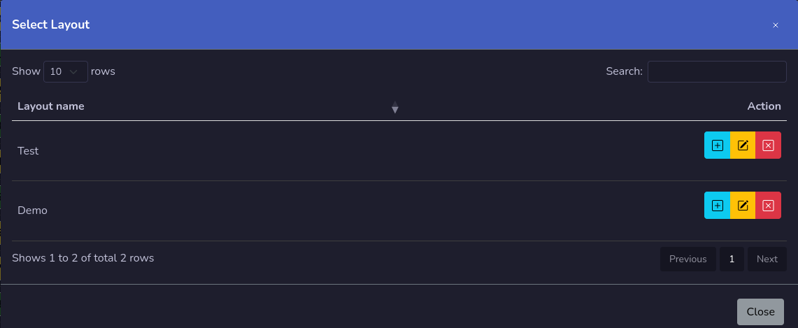

# Grids

Here do you manage your week with clocks. Each button represent one hour.

!!! Warning

    This will show the grid on the selected service. To manage another service grid you need to change to that service in the menu.

## Assign Clock

You assign a clock to the grid by pressing on that hour you would like to assign it to. On the window that will show you will get all your clocks.

Press **Add** button to add on that hour, if you press **Add on all** that clock will be added on **ALL** hours on all days!

## Clear All
You can clear your grid by pressing the clear all button, this will remove **ALL** clocks on all hours!

## Grid Layout
It's possible to save your grid layout for easy switch between layouts. Each grid layout is per Service.

!!! Info

    Grid layouts are not stored in rivendell, it's a feature that this web system has. It's stored in the data folder on the server. This is still under development and more features will be added.

### Save grid layout

Press the Save layout button to save that grid. Give it a name and press save. You can not use the same grid layout on other services.

### Select grid layout

Press the Select Layout button to change to another grid layout. Select what you would like to use and press the plus button.

!!! Danger

    The grid will be replaced with the selected grid layout as soon as you confirm that you want to add it.