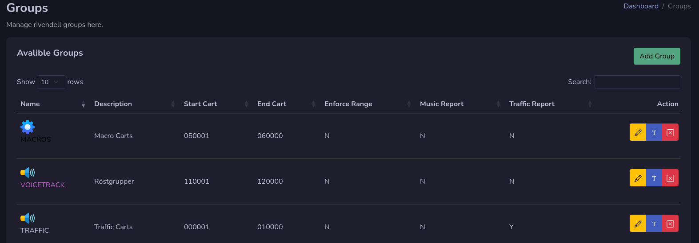
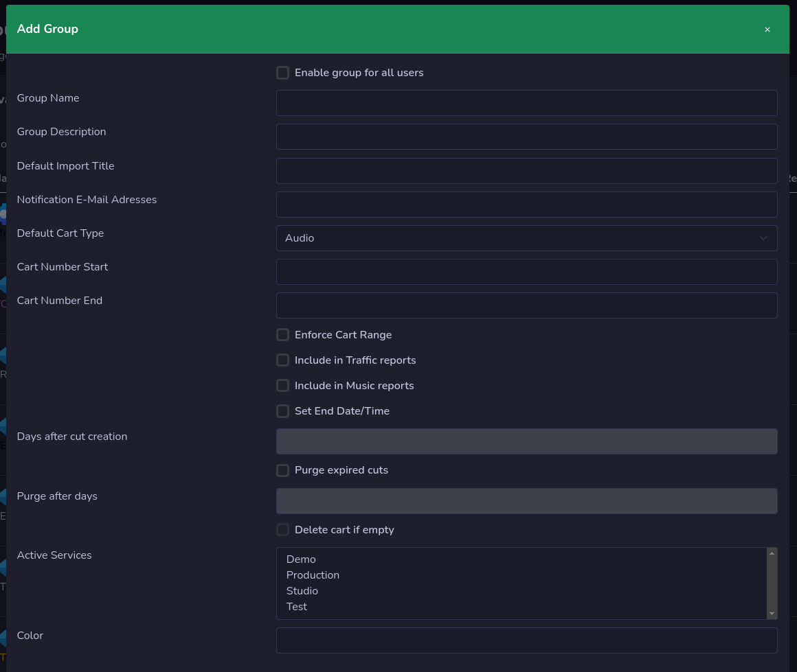

# Groups

All your rivendell groups can be manage here. You will see a list of all groups that are available in rivendell.

## Add Group

To add a new group press the **Add Group** button and set your options in the window that will popup.

## Edit Group
Press the yellow button with an pen on to edit your group.

## Rename Group
Press the button with an **T** on to rename that group

## Remove Group
You can remove a group by pressing the red button with an **X** on.

!!! Danger

    If you remove a group with cart in it, all carts will also be removed.