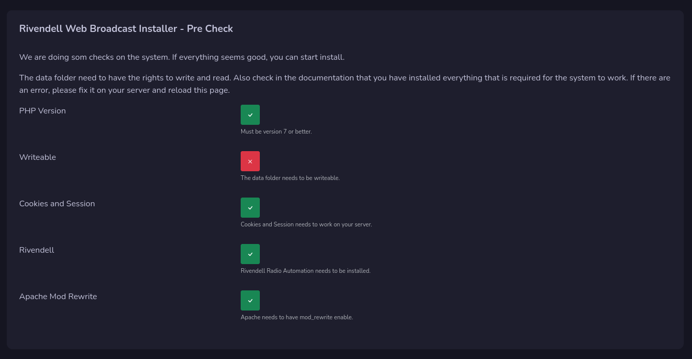

# Install Rivendell Web Broadcast

The installation of the system is simple, but before you install your system, you need to have all the requirements for your server.

!!! Info

    **This guide is for Debian based system**

## Install Dependencies

### Apache

Normally apache is installed during installation of Rivendell, but if not, you need to install it with following command:

`sudo apt install apache2 -y`

### mod_rewrite

To be able to use the system you need apache modrewrite installed. This is done by enable the apache module:

`sudo a2enmod rewrite`

Then you need to make changes in your apache config to allow .htaccess files:

Open up config file : `sudo nano /etc/apache2/apache2.conf`

Go and make sure that directory /var/www is set to **AllowOverride All**

### PHP

This is developed to work with PHP version 8 but will work on version 7 also.

Install php with following:

`sudo apt install php php-{common,mysql,xml,xmlrpc,curl,gd,imagick,cli,dev,imap,mbstring,opcache,soap,zip,intl,pdo} -y`

This will install PHP and modules that are common and needed.

Also make some adjustments in php.ini file that you will find in /etc/php/8.2/apache2 folder (replace 8.2 with the version number for your php)

Some suggestions:
**max_execution_time 180
memory_limit 128M
post_max_size 200M
upload_max_filesize 200M
max_input_time 60
max_input_vars 3000**

If you have problems load audio files or upload, you need to adjust these more.

Now restart apache: `sudo systemctl restart apache2`

### FFMPEG

For the moment we use FFMPEG to get the length of the audio files, this will be removed in the future, but for now you need to install FFMPEG on your server:

`sudo apt install ffmpeg`

## Install System

Now we are going to install the system on your server. This must be done on a server that has Rivendell installed.

Start by login to root user: `su -l`

Go to apache folder: `cd /var/www/html` and remove the index file: `rm index.html`

### Stable versions

A release file is "more stable" than the "github" code, when we update the version number we release a new release. This can contain less bugs, than clone the github code. And we recommend this way.

Download the latests release and extract it inside the /var/www/html folder.

### Development versions

If you want the latest changes in the system, Clone the github repository inside the html folder. 

!!! Warning

    **This is the development and changes a lot and can hold many bugs!**

### Data Folder

Chmod the data folder so it get read and write access. This folder store json settings files for the system, logeditor and password reset.

### Reverse Proxy

It's recommended that you use reverse proxy with https access before you expose the machine on the world wide web. For testing you can use http://localhost

Audio recording needs https access to work, but they will work on localhost also.

## Run the installer

Open up Rivendell Web Broadcast in your browser.

### Pre check

The installation will first check your system to see that the most important parts is correct on your server. If everything looks good, you can continue, if it's not good, there will be a red warning on that part. Fix that and reload the page to start installation by pressing the next button that will be available.  

### Admin user

Under the admin user field you enter your or anyones username on rivendell with normal user access on rivendell. This user will get admin access to the web system. 

!!! Info

    **Rivendells Admin user can not be used in this system**

Just enter one username now, you can add more later.

### SMTP Settings

The SMTP settings are used to send out emails in the system and is required.

## Updates

In the admin dashboard you will get information when a new release is avalible, This will only inform when there are new release on the release page on github.

To update just replace all files with the new updated, clear your catche and if needed there can be an update guide.

