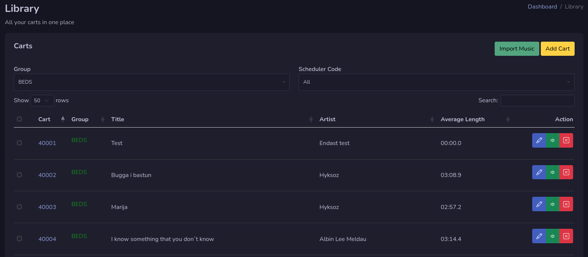
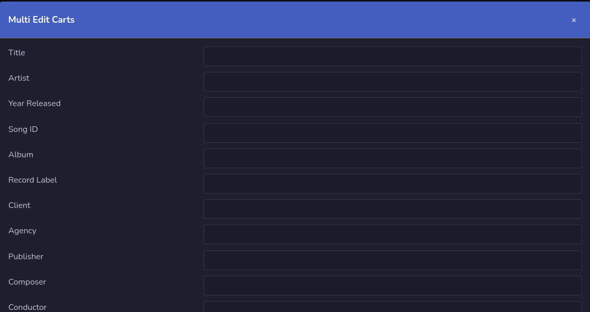
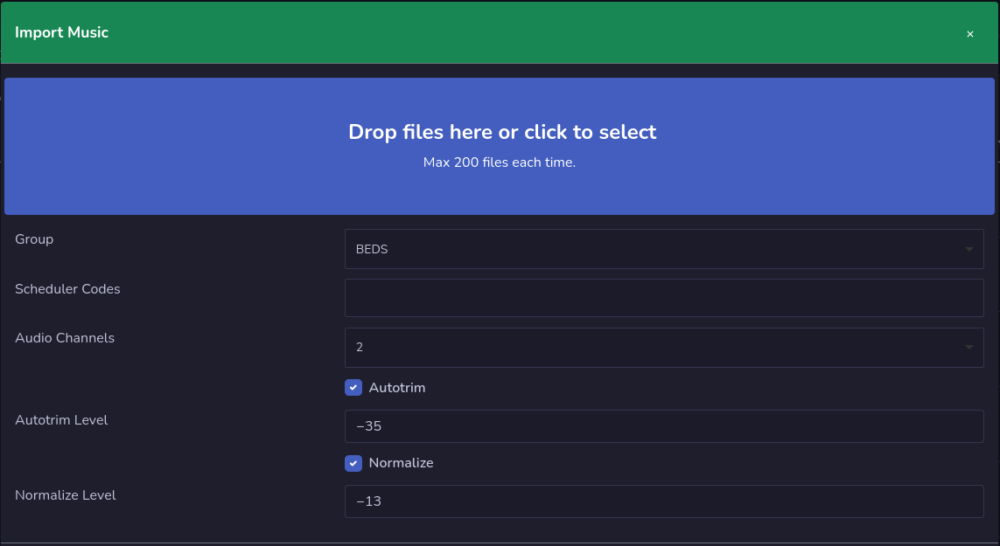
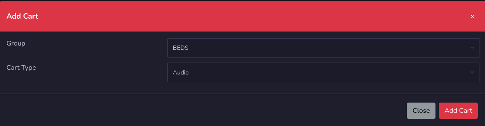

# Library

Library is the place where you find all your carts that you have access to. **Depending on how many groups you have access to.**

There are some main functions here that you can do.

## Group selection
On the drop down list you can select what group you would like to work in. You can also select to show all groups. The system will remember the group you have selected and store it in a cookie.

## Library Table
The library table you can select up to 100 carts per page. On the bottom you can go to next page if there are more than 100. In the search bar you can search for carts.

Each cart has action buttons that you can use depending on what you would like to do.

### Edit Cart
The pen button on each cart will take you to the edit page for that cart. You can also press on the cart number to go to the edit page.

### Remove Cart
The red button with an **X** on will remove the cart, you will get a warning before you remove the cart. **Voice tracks that belongs to logs can not be removed**

## Multi Edit Carts

The multi edit function let you edit multiple fields in multiple carts. You will get access to this function if you check the check boxes that are before cart numbers on the carts you will edit.

You will see that it will pop up two buttons on the screen, click on Multi edit carts button, and it will pop up a window where you can make changes in. **Only fields that you write in will be updated.**

## Delete Carts
You can delete multiple carts by select the check boxes and press the Delete Selected button that will pop up. **Voice tracks that belongs to logs can not be removed**

## Import Music

You can import multiple audio files to rivendell by pressing the Import Music button. This is like the dropbox function in Rivendell.

### Set settings
Before you begin import audio, set your settings first, select group, scheduler codes etc.

### Add your files
To add your files, you can drag your files to the blue box in the window to start upload them. Or click in the blue box to select your files.

The audio files will be added one by one, and when it's imported it will be removed from the list.

## Add Cart

You can add a new empty cart by pressing the add cart button. A new window will popup and you need to select a group and select if it's an audio cart or an macro cart.

When it's created you will be redirected to cart edit page.