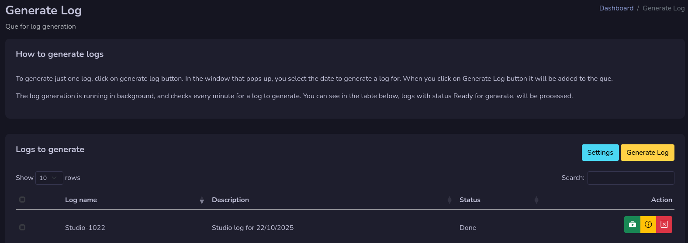
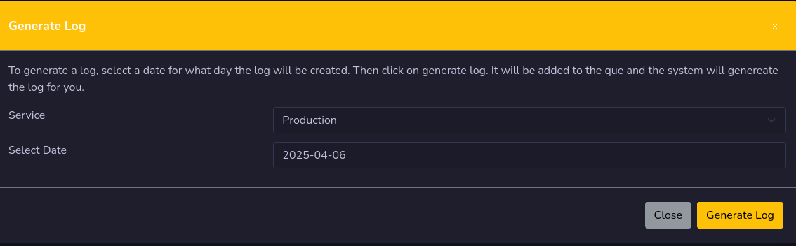
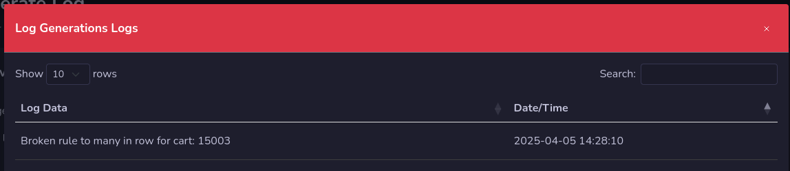

# Log Generator

!!! Danger

    **This is for testing only, and need to be enable in settings by an administrator. Do not test it on a live production machine. Right now it's not possible to use external scheduler with this log generation. It has not been built in yet. Don't forget to setup cron job for log generation, more info in installation section.**

Log generation is where you generate scheduled logs. 

It uses the same procedure as the original log generator, but it can handle multiple logs to be added at the same time for log generation.

## Generate Logs

Press the generate log button to open the window where you select log service and date for log generation. When you have select correct service and date, press the Generate log button to add it to generate list.

!!! Info

    **It's possible to select multiple dates to add for log generation**

If a log exist, it will warn you about it. And if you agree, it will remove the old log when the new one is generated.

## Logs List
The log list holds all logs that going to be generated or has been generated.

!!! Info

    **If the log has a purge date set to auto remove, the log generator data will also be removed on that day.**

In the status section, you can see if the log is ready for log generation, is generating or done.

The green button on each log is for regenerate a log. If you click on that it will remove the old one and generate a new one.

## Log generation Log

The log generation logs is located if you press the yellow information button. It store the information on the web server only and you can find information on the log generation.

!!! Info

    **During the development there will be more log information than needed. Some information will be removed when a more stable version is ready.**

## Remove log generation data
You can remove the log generation data by pressing the red X button. No real logs will be removed, only log generation data, and they are stored on the web server only.

You can also remove multiple log generation data if you check the check boxes and press the delete selected button that will pop up.