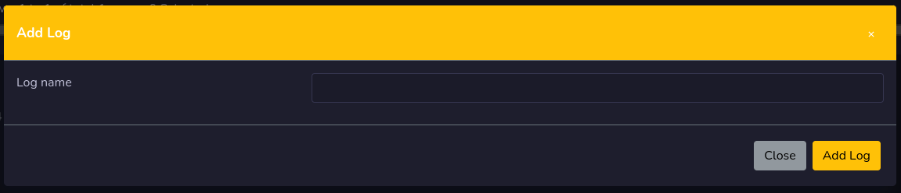

# Logs

Logs is the place where you can manage your logs in rivendell. Here you will find all available logs.

**Only logs that belongs to the active service will be displayed in the logs window**

In the table you will get important information like how many voice tracks that are recorded and needs to record. If an log is red, you need to record voice tracks,

## Add Log

If you press the add log button you will be able to create a new empty log. Give it a name and press the add log button.

## Edit Log
To edit a log you press on the log name to open up the log editor.

## Record Voice track
To do recording for voice track, you press the microphone button on the log, to go to voice track part.

## Remove log
To remove a log you press the red button with an **X** on it. You can also remove multiple logs by check the check boxes on logs and press the delete selected button.

**Voice track carts that belongs to logs will also be removed**