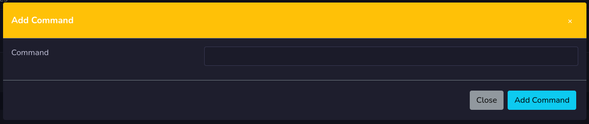

# Macro Cart

Here do you manage your macro cart, you set your settings for your cart and press save.

## Commandos

In your macro cart you have your commandos, where you tell what your macro cart will do. 

!!! Warning

    **You need to press the save button to save changes to the macro commands.**

### Add Command

Press the add command button to have the window popup for you to set the new command.

!!! Info

    The new command will be added at the bottom.

## Move Command
You can move a command up or down by pressing on a arrow up or down.

### Edit Command
You can edit a command by pressing the pen button.

## Copy Command
You can copy the command by pressing the copy button. You will be able to modify it before it will be added. When added it will be added on last row.

### Remove Command
To remove a command just press the red button with an **X** on. You will need to confirm that.