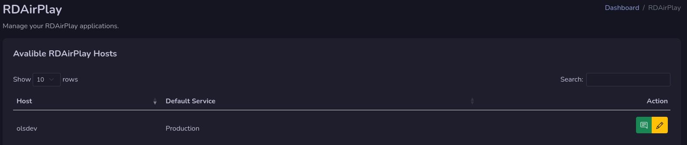

# RDAirPlay

Manage your RDAirPlay application here.

## Add Message

You can set a message in RDAirPlay message window as it has sins version 4.2.0 support for url messages.

Write your message in the window (you can use HTML codes).

### Set the url
To set RDAirPlay to display that message, you need to send a macro command to it. The following command is used to display your message:

`LM https://yourhost.com/api/getmessage.php?station=thehostname!`

!!! Info

    **Replace yourhost.com with your address to Rivendell Web Broadcast and thehostname with the hostname where your RDAirPlay is on.** The ! is needed at the end.

## Edit RDAirPlay

You can set your RDAirPlay settings when you press the yellow button with an pen on it. Not every settings is possible to set.