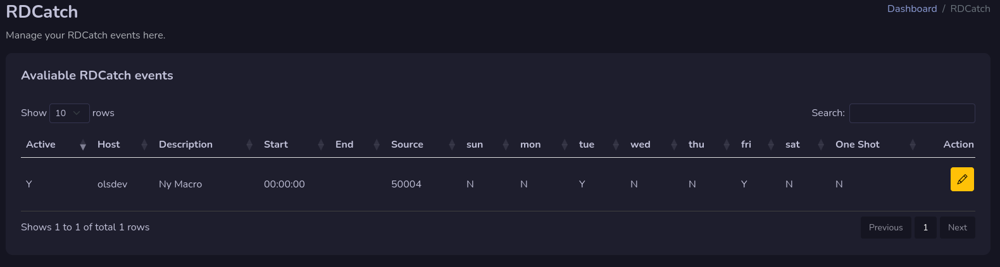
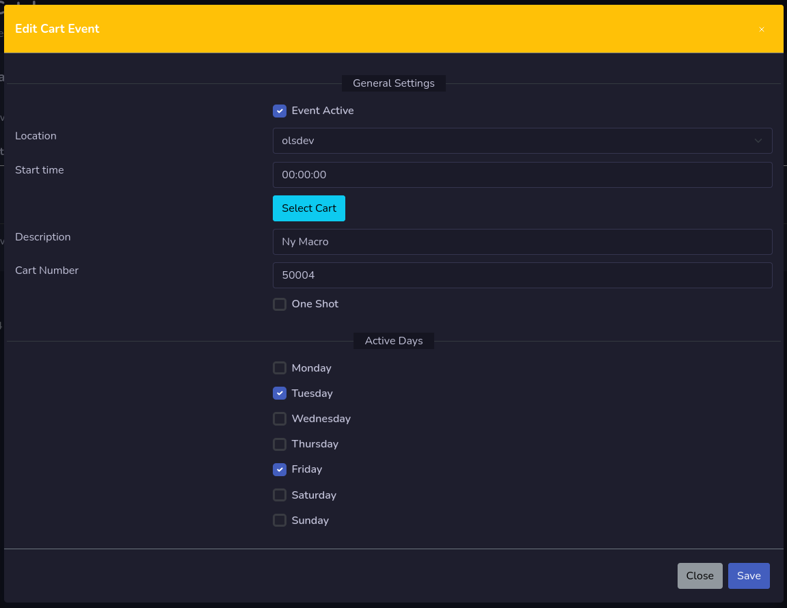
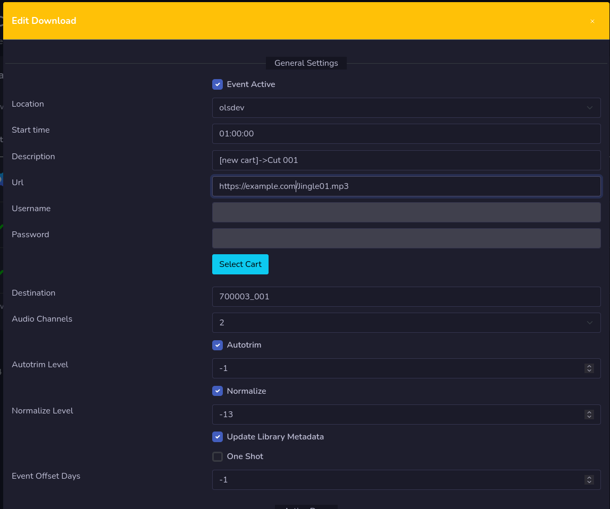

# RDCatch

RDCatch is the place where you manage your RDCatch events. You need to have the host rights on your user to be able to access this part.

!!! Warning

    **This is still in early develop, for the moment you can only edit macro events, download events and upload events. More function will come during the development.**

## Add RDCatch Event.
To add an RDCatch event, press on the Add button and select what type of event you would like to add.

## Remove RDCatch Event
To remove an RDCatch Event press the red **X** button on that event. You will need to confirm your removal.

## Edit Macro Event

Click on the yellow button with an pen on it to edit macro event. A window will open for you to edit that event.

You can press the Select Cart button to open up and select a macro cart.

## Edit Download Audio Event

To edit an download event, press the yellow pen button on that event to open up the edit window.

To change the destination cut, press the Select Cart button. Select the audio cart you would like to use. By default it will select the cut for you.

If you need to change the cut to another one, press the button Select Cut that now is visible. **Only cuts that belongs to selected cart will be visible**

## Edit Upload Audio Event

To edit an upload event, press the yellow pen button on that event to open up that edit window.

Just like for download to select a destination, you press the Select Cart button, and if you need to select another cut than what is assigned, press the select cut button and assign that cut.

## Edit Switches Event

To edit an switch event, press the yellow pen button on that event to open up that edit window.

The Switch Matrix Will change depending on your location setting in event, and Switch Output and Input will change depending on you Switch Matrix setting in event.