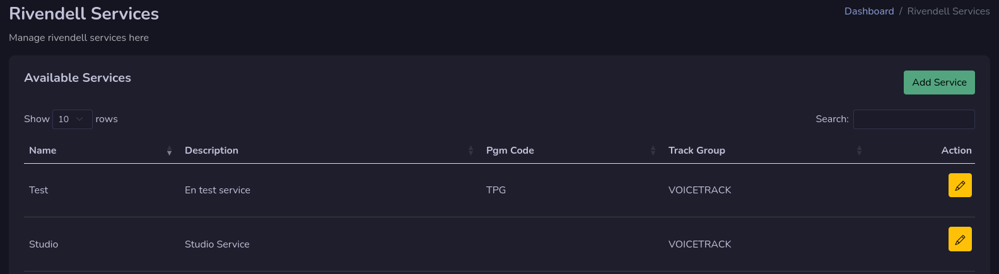
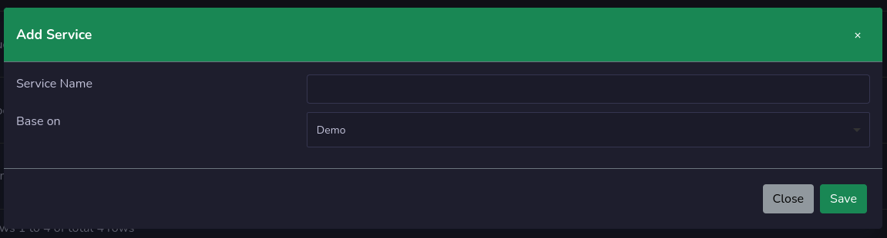
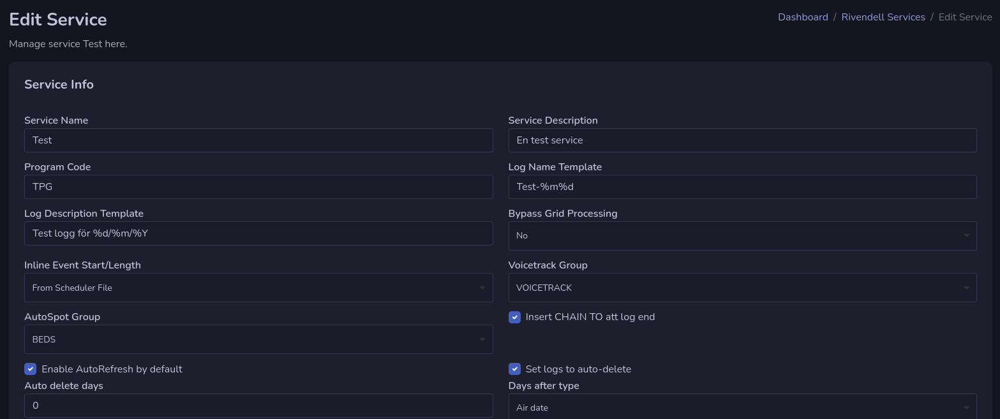

# Services

This is the place where you manage your services on rivendell.

## Add Service

By pressing the **Add Service** button you can add a new service to rivendell.

Give it a service name and if you would like to do a copy of another service you select that one in based on, othervice choose none.

## Edit Service

By pressing the yellow pen button you can manage that service.

### Service Info
You set your service information under service info section. When you are done you press **Save** button.

### Autofill

In the Autofill section you add the carts that are used in the autofill function for that service. Press the **Add Cart** button to add a new cart to autofill and select a cart.

You can remove one by press the red button with an **X** on it.