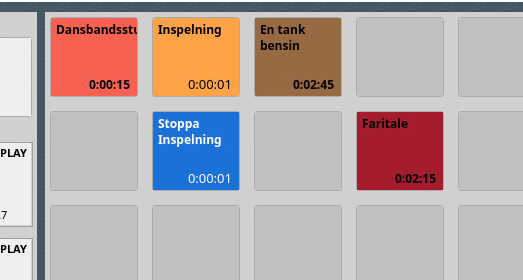
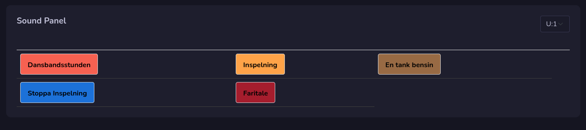

# Soundpanel

Soundpanel is an pwa app that you can use to control RDAirPlay soundpanels thru an tablet.

## How it works

Instead of using your mouse on soundpanel in RDAirPlay you can use your tablet as a touch screen to start them.

The soundpanels that are setup in RDAirPlay on system or user will be avaliable. To use it you need to login with your user in Rivendell. The same user need to login in Rivendell Web Broadcast.

You will now have access to soundpanels. Just click on one and it will run in RDAirPlays soundpanel. In top right corner you can change to another panels. You will also have access to system panels.

!!! Info

    **Go to https://yourdomainname.com/touch/panel (where yourdomainname is the name for your rivendell web broadcast) and your panels will be visible.**

## Install as an app
Go to https://yourdomainname.com/touch/login (where yourdomanname is the name for your rivendell web broadcast) and save it to your homescreen in your tablet. It will install as an PWA app and will be easy to access.

You need to first be logged out on Rivendell Web Broadcast