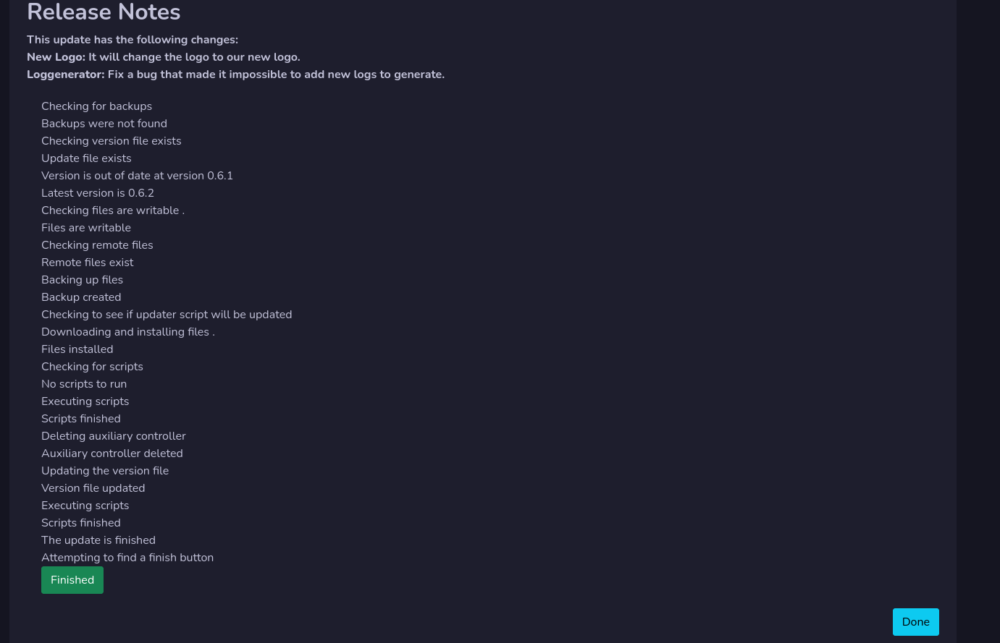
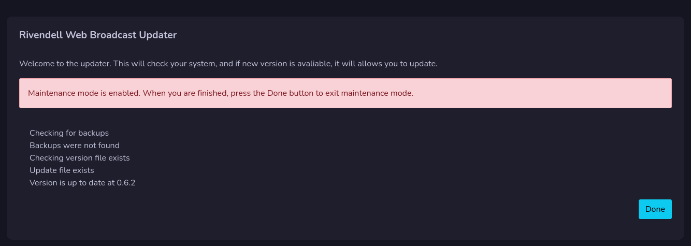

# Update Rivendell Web Broadcast

When you are in update window you can do updates directly to the system without have to manage files on your server.

!!! Info

    **You need to have admin rights to do updates**

When you are in update mode, your system will be put in maintenance mode.
This means that your user can not use the system during the update.

## Update system
To update your system press the **Update now** button.

If there are no problems, your update will finish with success. But if there are problems it will inform you about it and abort the update.

The update system will do:

- Backups
- Check if it has read and write access
- Run scripts (If needed for the system)
- Update your files

The update system only updates files that has been changed or added, it don't replace all files. So the update should be done quickly.

!!! Warning

    **There must be read and write on the files on the server for the update system to work.**

## Update is done
When the update is done, press the **Finished** button to reload the update window to make sure everything was successful.

It will inform you that the version is up to date. Now just click on **Done** button to exit the update and release the Maintenance mode.