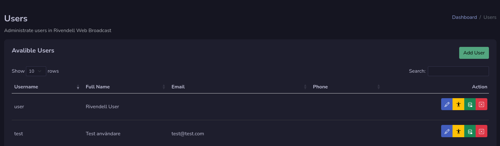
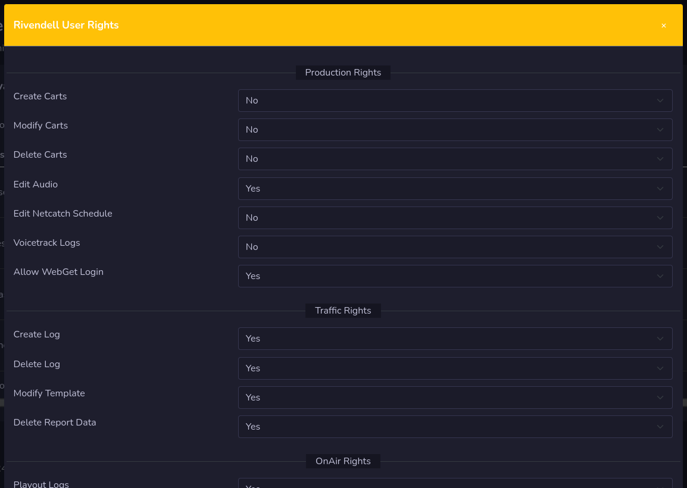
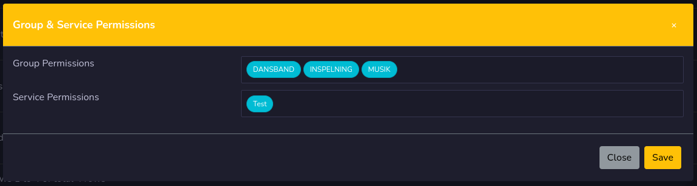

# Users

Users are the users that are in rivendell and there are both rivendell settings here for users and also settings for this system.

!!! Info

    Settings for this web system are not stored in rivendells database. It is stored in the json settings file on the server.

## Add User

By pressing the **add user** button you can add a new user to rivendell.

You need to set at least:

- Username
- Full Name
- Email
- Group Permissions
- Service Permissions

!!! Warning

    You don't set any password, it will be generated and send out to mail to the new user.

## Edit User

Here can you set the user profile data and also admin rights.
You need to set **Give admin rights** to yes to be able to set other admin options.

If the user only have **Give admin rights** it will only see the admin dashboard.

## Edit Rivendell Rights

This section allows you to set the rights in rivendell. It will affect both in the web system and also in rivendell software.

## Group & Service Permissions

This part will allows you to set the group and service permission for this user in rivendell.

## Remove user
You can remove a user by pressing the red button with an **X** on it. It will remove the user from rivendell system.

!!! Warning

    You can not remove your self as a security function.