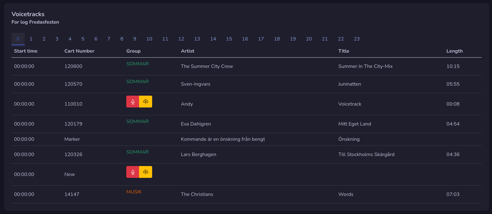

# Voice tracking

If you need to record voice track your log will be displayed with hours selectors. Each page is one hour.

For voice track you have two options, record directly in your browser or upload an pre recorded file.

## Record audio

You can record voice track by pressing the microphone button. A new window will pop up and start by pressing the record button.

If you not have select your input, you will have to do it first, then the recording will start. When you are done, click on stop button.

Your recording will show below where you can pre listen, save recording and download recording. If you are happy with the recording, press save, if not then you can start over and do a new recording.

!!! Warning

    Before you save your voice track check the settings on top!

## Upload audio

By pressing the yellow cloud button you can upload an audio file. Just drag your file to the blue box or click in it to select an audio file to upload.

!!! Warning

    Before you upload your voice track check the settings below the blue box!